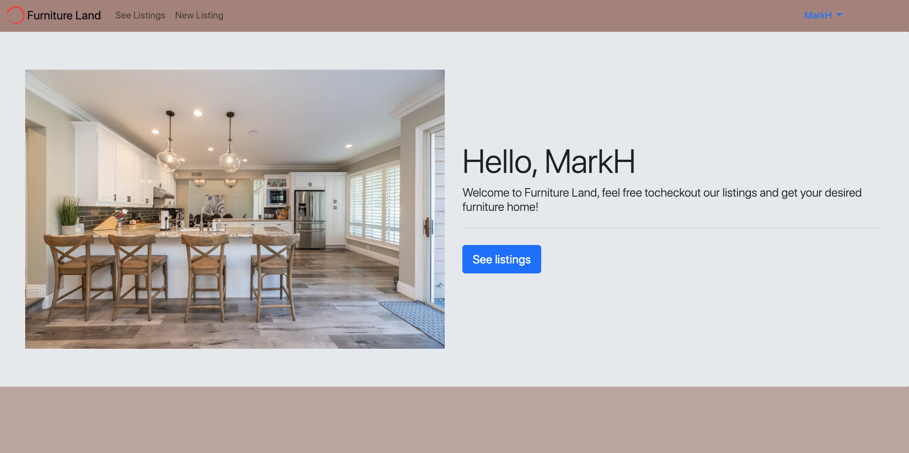
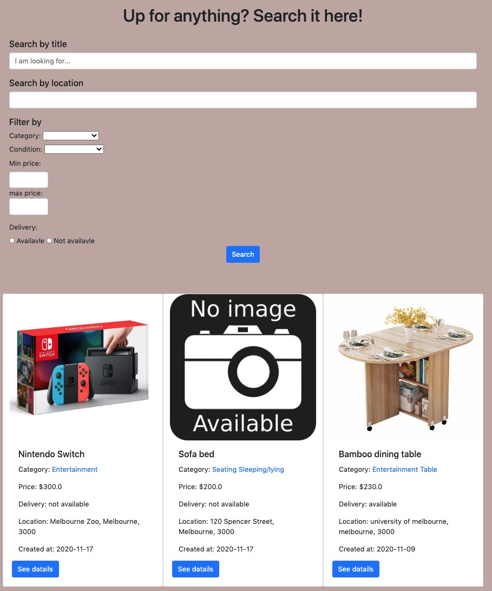
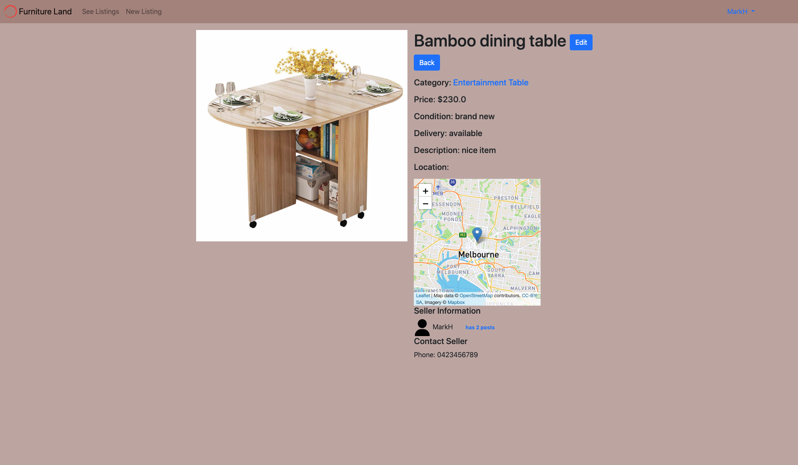
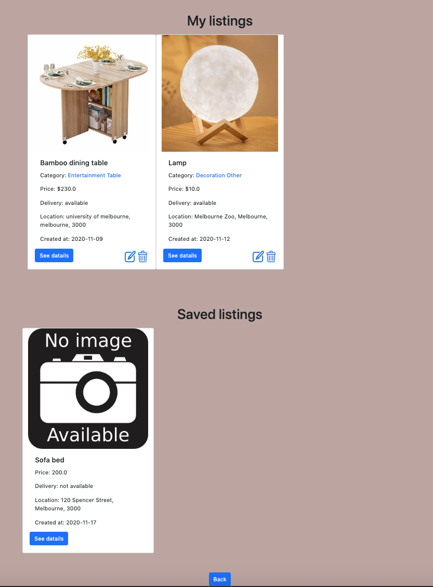
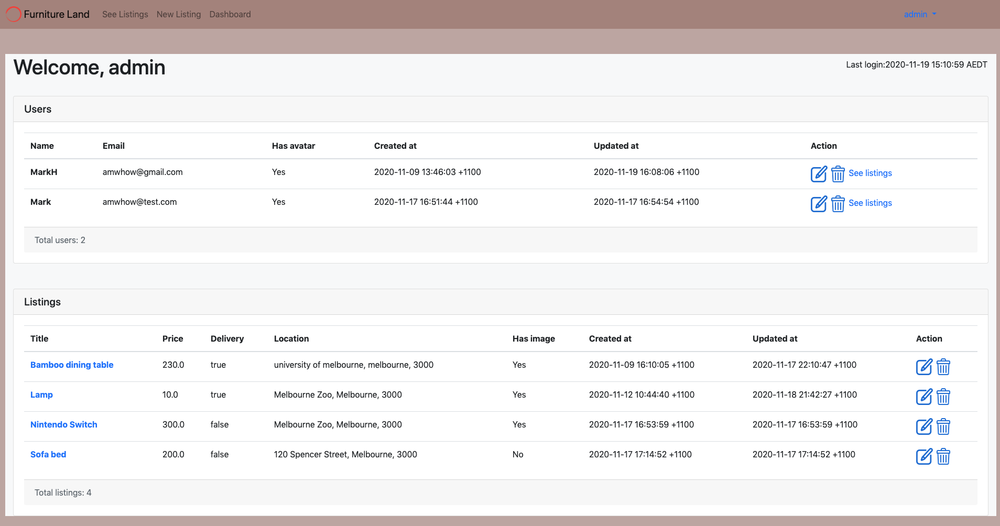

# Furniture Land - A second-hand furniture/home goods trading web app
Site Link: https://furniture-land.herokuapp.com/. 

## Table of contents
* [General info](#general-info)
* [Screenshots](#screenshots)
* [Technologies](#technologies)
* [Features](#features)
* [Status](#status)

## General info
This is a Facebook-Marketplace-like app but specific to second-hand furniture trading. There is a great need of selling furnitures and home goods for international students (especially in Australia) when it's the graduating season. This app may help those students find buyers/sellers that lives nearby.

## Screenshots
welcome page:  
     
listings page:  
     
listing show page:  
     
my_listing:  
     
edit_profile:  
     
admin_dashboard:  
     
   

## Technologies
* Ruby  
* Ruby on Rails
* Heroku
* AWS S3
* Leaflet and mapbox
* PostgreSQL

## Features
* Search listings by keyword
* Filter listings by multiple conditions
* Save a listing
* Show listing location
* Admin dashboard
* User authentication and authorisation
* Image uploading. 

## Status
Project is: _finished_

## Usage
* Visit the site via the url on the top and you can use this demo account to see how the functions work. (username: amwhow@gmail.com; password: 123123).  
* When you sign up a new account, all fields must be filled in.  
* Feel free to play around with the app and any feedback is welcome!
